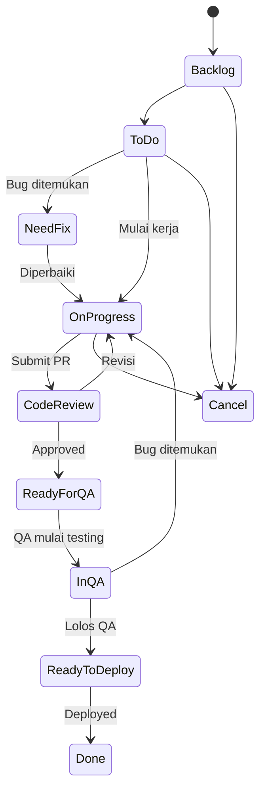
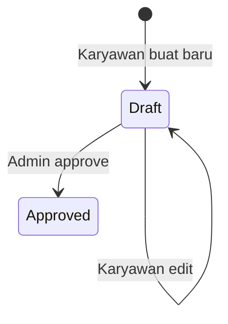

# PRD: Sistem Work Tracking ERP-Style — MST Ticket Manager

**Versi**: 1.0  
**Tanggal**: 29 Mei 2026  
**Penulis**: AI Assistant  
**Status**: Draft — Menunggu Review

---

## 1. Ringkasan Eksekutif

Dokumen ini mendefinisikan kebutuhan produk untuk membangun sistem **Work Tracking** bergaya ERP ke dalam aplikasi MST Ticket Manager yang sudah ada. Sistem ini terinspirasi dari modul **"Gawean"** pada platform ERP Odoo milik CNT IT Corporation (`erp.cnt.id`), yang mengelola tiket pekerjaan, daily check-in karyawan, dan tracking manhours.

---

## 2. Analisis Sistem Referensi (Odoo — Gawean Module)

Berdasarkan 7 gambar yang diberikan, berikut analisis detail setiap layar:

### 2.1. Login Page


- Login menggunakan **Email + Password**
- Terdapat opsi **Login with Google (OAuth)**
- Branding perusahaan (logo CNT IT Corporation)
- URL: `erp.cnt.id/web/login`

### 2.2. Gawean List View (Ticket List)


**Kolom-kolom yang teridentifikasi:**

| Kolom | Deskripsi |
|-------|-----------|
| Created on | Timestamp pembuatan tiket (format: `MM/DD/YYYY HH:MM:SS`) |
| Due Date | Tanggal jatuh tempo |
| Client | Nama klien/proyek (e.g., "Rumah Zakat", "Yayasan Dana Sosial Al Falah YDSF") |
| Subject | Deskripsi pekerjaan (e.g., "#Carry Over - API Get Verification check") |
| Priority | Level prioritas (e.g., "3. Normal (Sedang)") |
| Reported To | Pelapor / atasan yang dituju |
| Assignee | Pengerjaan tiket |
| Manhours | Estimasi jam kerja (e.g., 1.00, 3.00, 5.00, 10.00) |
| State | Status tiket dengan **badge warna** |

**State yang teridentifikasi (dengan warna):**

| State | Badge Color | Deskripsi |
|-------|------------|-----------|
| On Progress | 🟢 Hijau | Sedang dikerjakan |
| ToDo | 🔵 Biru Tua | Sudah dijadwalkan, belum mulai |
| Backlog | Abu-abu | Belum dijadwalkan |
| Code Review | 🟡 Kuning/Hijau | Menunggu review code |
| Done | 🟢 Hijau Tua | Selesai |

**Fitur navigasi & filter:**
- Top menu: **Gawean, Check In, Product, Project, Config**
- Filter aktif: `Assign To Me ×` (quick filter)
- Toolbar: Filters, Group By, Favorites
- Pagination: `1-20 / 63`
- View toggle: List, Kanban, Pivot, Graph, Calendar

### 2.3. Check-In List View (Daily Standup)


**Kolom-kolom:**

| Kolom | Deskripsi |
|-------|-----------|
| Created On | Timestamp check-in |
| Employee | Nama karyawan |
| Divisi | Divisi/squad (e.g., "SQ Backbone", "SQ Innovation", "SQ ZAINS") |
| Action Items | Daftar pekerjaan hari ini — linked ke tiket (e.g., `DOB-19999`, `ZB-20247`) |
| Yesterday Problem | Masalah kemarin (e.g., "Full support RZ Review and Deployment") |
| Tickets | Jumlah tiket yang dilampirkan (e.g., "2 records", "4 records") |

**Fitur penting:**
- Filter aktif: `Check In Today ×`
- Setiap action item **me-refer ke tiket ID** + subject + status dalam kurung siku
- Contoh format: `► DOB-19999 Implement Integration Testing CF API KI [On Progress]`
- Tombol **NEW** untuk membuat check-in baru
- Action items mendukung teks bebas + referensi tiket

### 2.4. Check-In Form (New Check-In)


**Field-field:**
- **Employee**: Auto-filled (linked ke user login, e.g., "Fadil Dzaky")
- **Divisi**: Auto-filled (e.g., "SQ ZAINS")
- **Yesterday Problem**: Text area kosong
- **Action Items**: Rich area dengan tab **"Focus Today"**
- **Status bar**: DRAFT → APPROVED (workflow state)
- Tombol **ADD** untuk menambah action items
- Action: Save, New

### 2.5 & 2.6. Gawean Ticket Detail (Form View)
````carousel

<!-- slide -->

````

**Field-field pada ticket detail:**

| Field | Contoh Value | Tipe |
|-------|-------------|------|
| ID Ticket | ZB-20129 | Auto-generated, format: `[PREFIX]-[NUMBER]` |
| Priority | 3. Normal (Sedang) | Selection: 1-5 |
| Manhours Selection | 5 | Dropdown estimasi jam |
| Need QA? | ☐ (checkbox) | Boolean |
| Actual Manhours | 1.00 | Numeric, diisi manual |
| Client | Rumah Zakat | Dropdown relasi |
| Product | ZAINS | Dropdown relasi |
| Project | Zains Anggaran dan Realisasi | Dropdown relasi |
| Label | `System Request ×`, `Carry Over ×` | Multi-tag |
| Subject | #Carry Over - Penambahan Akses... | Text |
| Attachment | UPLOAD YOUR FILE | File upload |
| Description | Rich text | Markdown/HTML |
| Start Date | 05/25/2026 | Date picker |
| Due Date | 06/05/2026 | Date picker |
| Done Date | (kosong) | Date, auto-fill saat Done |
| Category | Development | Selection |
| State | On Progress | Selection dropdown |
| Reported To | — | User relation |
| Assignee | — | User relation |
| Divisi | — | Dropdown |
| Repeat | — | Recurring setting |
| Sprint | — | Sprint relation |
| COPY | — | Duplikasi tiket |

**State Machine (Workflow) yang teridentifikasi:**
```
Backlog → ToDo → Need Fix → On Progress → Code Review → Ready For QA → In QA → Ready to Deploy → Done
                                                                                                    ↓
                                                                                                 Cancel
```

**Category options:**
- Service & Support
- Finance & Sales
- Development
- Infrastructure & Operations
- QA & Testing
- Coordination & Management
- Design (UI/UX)
- Internal & Learning

**Activity Log (Chatter):**
- Timeline aktivitas di sisi kanan
- Format: `[User] - [waktu lalu] • [deskripsi perubahan]`
- Contoh: "Fadil Dzaky · 5 days ago • Backlog → On Progress (State)"
- Tombol: **Send message**, **Log note**, **Attachment**, **Follow**

### 2.7. Ticket Detail - State Dropdown Close-Up


Konfirmasi 10 state lengkap:
1. **Backlog** — Pekerjaan belum dijadwalkan
2. **ToDo** — Sudah dijadwalkan, menunggu dikerjakan
3. **Need Fix** — Ada masalah, perlu diperbaiki
4. **On Progress** — Sedang dikerjakan aktif
5. **Code Review** — Menunggu peer review
6. **Ready For QA** — Siap untuk diuji QA
7. **In QA** — Sedang diuji oleh tim QA
8. **Ready to Deploy** — Lolos QA, siap deploy
9. **Done** — Selesai
10. **Cancel** — Dibatalkan

---

## 3. Tujuan Produk

### 3.1. Problem Statement
Sistem MST Ticket Manager saat ini masih sederhana (MVP) dengan hanya 3 status (Belum Mulai, Sedang Dikerjakan, Selesai) dan tidak memiliki fitur:
- Daily check-in / standup digital
- Workflow state machine lengkap
- Tracking manhours
- Activity log / audit trail
- Multi-client & multi-project management
- Label & tag system
- File attachment
- Relasi tiket ke check-in

### 3.2. Goals
1. **Upgrade workflow** dari 3 status menjadi 10 status sesuai ERP reference
2. **Tambah modul Check-In** untuk daily standup digital
3. **Tambah tracking manhours** (estimasi vs aktual)
4. **Tambah activity log** pada setiap tiket
5. **Tambah sistem client, product, project** hierarchy
6. **Tambah label/tag system** untuk kategorisasi
7. **Tambah kategori pekerjaan** (Development, QA, Design, dll.)
8. **File attachment** pada tiket

### 3.3. Non-Goals (Out of Scope untuk V1)
- Google OAuth login
- Recurring/repeat task
- Multiple view types (Kanban, Pivot, Graph, Calendar)
- Full RBAC (Role-Based Access Control)
- Email notification / real-time notification
- Sprint planning module yang kompleks

---

## 4. User Personas & Stories

### 4.1. Personas

| Persona | Deskripsi | Kebutuhan Utama |
|---------|-----------|-----------------|
| **Admin / Project Lead** | Mengelola seluruh tiket, assign pekerjaan, monitor progress | Overview dashboard, buat/edit tiket, lihat semua check-in |
| **Developer / Anggota Tim** | Mengerjakan tiket, update status, daily check-in | Board tugas pribadi, update status, check-in harian |
| **Viewer / Guest** | Melihat progress tanpa edit | Read-only dashboard |

### 4.2. User Stories

#### Modul Gawean (Ticket)
| ID | Story | Priority |
|----|-------|----------|
| US-01 | Sebagai admin, saya ingin membuat tiket baru dengan field lengkap (client, project, priority, manhours, category, labels) | P0 |
| US-02 | Sebagai admin, saya ingin melihat daftar tiket dengan filter dan sorting | P0 |
| US-03 | Sebagai developer, saya ingin mengubah status tiket melalui 10-step workflow | P0 |
| US-04 | Sebagai admin, saya ingin melihat detail tiket lengkap dengan activity log | P0 |
| US-05 | Sebagai admin, saya ingin menambahkan label/tag ke tiket | P1 |
| US-06 | Sebagai developer, saya ingin melampirkan file ke tiket | P1 |
| US-07 | Sebagai admin, saya ingin meng-copy/duplikasi tiket | P2 |
| US-08 | Sebagai admin, saya ingin memfilter tiket berdasarkan "Assign To Me" | P0 |
| US-09 | Sebagai admin, saya ingin melihat manhours estimasi vs aktual | P1 |

#### Modul Check-In (Daily Standup)
| ID | Story | Priority |
|----|-------|----------|
| US-10 | Sebagai anggota tim, saya ingin membuat check-in harian | P0 |
| US-11 | Sebagai anggota tim, saya ingin menulis yesterday problem di check-in | P0 |
| US-12 | Sebagai anggota tim, saya ingin menambahkan action items dengan referensi tiket | P0 |
| US-13 | Sebagai admin, saya ingin melihat semua check-in hari ini | P0 |
| US-14 | Sebagai admin, saya ingin meng-approve check-in anggota | P1 |
| US-15 | Sebagai admin, saya ingin melihat berapa tiket yang di-attach ke check-in | P1 |

---

## 5. Spesifikasi Fitur Detail

### 5.1. Enhanced Ticket (Gawean)

#### 5.1.1. Ticket Fields
```
┌──────────────────────────────────────────────────────────┐
│ GAWEAN TICKET                                            │
├──────────────────────────────────────────────────────────┤
│ ID Ticket:     [AUTO-GENERATED]    Start Date: [DATE]    │
│ Priority:      [DROPDOWN 1-5]      Due Date:   [DATE]    │
│ Manhours Est:  [NUMBER]            Done Date:  [AUTO]    │
│ Need QA?:      [CHECKBOX]          Category:   [SELECT]  │
│ Actual MH:     [NUMBER]            State:      [SELECT]  │
│ Client:        [DROPDOWN]          Reported To:[SELECT]  │
│ Product:       [DROPDOWN]          Assignee:   [SELECT]  │
│ Project:       [DROPDOWN]          Divisi:     [SELECT]  │
│ Label:         [MULTI-TAG]         Sprint:     [SELECT]  │
│                                                          │
│ Subject:       [TEXT]                                     │
│ Attachment:    [FILE UPLOAD]                              │
│ Description:   [RICH TEXT AREA]                           │
└──────────────────────────────────────────────────────────┘
```

#### 5.1.2. Ticket ID Format
- Format: `[PROJECT_PREFIX]-[AUTO_INCREMENT]`
- Contoh: `ZB-20129`, `DOB-19999`, `INO-20225`
- Prefix ditentukan oleh Product/Project

#### 5.1.3. State Machine


#### 5.1.4. Priority Levels
| Level | Label | Badge Color |
|-------|-------|-------------|
| 1 | Kritis (Urgent) | 🔴 Red |
| 2 | Tinggi (High) | 🟠 Orange |
| 3 | Normal (Sedang) | 🔵 Blue/Indigo |
| 4 | Rendah (Low) | ⚪ Gray |

#### 5.1.5. Categories
- Service & Support
- Finance & Sales
- Development
- Infrastructure & Operations
- QA & Testing
- Coordination & Management
- Design (UI/UX)
- Internal & Learning

### 5.2. Check-In Module (Daily Standup)

#### 5.2.1. Check-In Form
```
┌─────────────────────────────────────────────────────┐
│ CHECK IN / New                    [DRAFT] → APPROVED│
├─────────────────────────────────────────────────────┤
│ Employee:          [AUTO-FILLED dari user login]    │
│ Divisi:            [AUTO-FILLED dari user profile]  │
│ Yesterday Problem: [TEXT AREA]                      │
│                                                     │
│ Action Items:                                       │
│ ┌─────────────────────────────────────────────────┐ │
│ │ Focus Today                                     │ │
│ │ ┌─────────────────────────────────────────────┐ │ │
│ │ │ [ADD] tiket referensi + deskripsi           │ │ │
│ │ └─────────────────────────────────────────────┘ │ │
│ └─────────────────────────────────────────────────┘ │
└─────────────────────────────────────────────────────┘
```

#### 5.2.2. Check-In Workflow


#### 5.2.3. Action Items Format
Setiap action item bisa berisi:
- **Referensi tiket**: `► [TICKET_ID] [Subject] [State]`
- **Teks bebas**: deskripsi tambahan di bawah tiket
- Contoh:
  ```
  ► DOB-19999 Implement Integration Testing CF API KI [On Progress]
    - Melanjutkan progress dan melakukan self test
  ► DOB-20243 #Carry Over - Fix High Priority Issues [Code Review]
    - Merge Request Frontend
  ```

### 5.3. Activity Log (Chatter)

Setiap tiket memiliki activity log yang mencatat:
- **State changes**: `Backlog → On Progress (State)`
- **Check-in references**: `Ticket ditambah ke fokus checkin [User] tanggal [Date]`
- **Sprint assignment**: `#9 W18-W19 2026 → None (Sprint)`
- **Creation**: `Gawean Ticket created`

Format log:
```
[Avatar] [User Name] · [Waktu relatif]
• [Deskripsi perubahan]
```

### 5.4. List View Enhancements

#### 5.4.1. Ticket List Columns
Kolom yang harus ditampilkan:
1. Created on (sortable)
2. Due Date (sortable, default sort)
3. Client
4. Subject
5. Priority
6. Reported To
7. Assignee
8. Manhours
9. State (badge berwarna)

#### 5.4.2. Filter & Search
- Quick filter: "Assign To Me"
- Full filter builder (by field)
- Group By (by assignee, client, state, priority)
- Favorites (saved filter)
- Full text search
- Pagination (20 items per page)

---

## 6. Wireframe Konseptual

### 6.1. Layout Navigasi
```
┌────────────────────────────────────────────────────────────┐
│ [Logo] MST   Gawean  Check In  Product  Project  Config   │
│                                              [🔔] [User]  │
├────────────────────────────────────────────────────────────┤
│                                                            │
│   [Page Title]                                             │
│   [NEW]  [Filters] [Group By] [Favorites]  [1-20/63] [<>] │
│                                                            │
│   ┌────────────────────────────────────────────────────┐   │
│   │  Content Area (List / Detail / Form)               │   │
│   │                                                    │   │
│   └────────────────────────────────────────────────────┘   │
└────────────────────────────────────────────────────────────┘
```

### 6.2. Ticket Detail Layout
```
┌──────────────────────────────────┬───────────────────────┐
│ [Breadcrumb] 1/20 [< >]         │ [Send message][Log]   │
├──────────────────────────────────┤ [Follow]              │
│ [PROGRESS] [CODE REVIEW] [TO P] │                       │
│                                  │   Activity Log        │
│ ┌──────────────────────────────┐ │   ┌─────────────────┐ │
│ │ GAWEAN TICKET    [Check-Ins] │ │   │ May 25, 2026    │ │
│ │                              │ │   │ [Avatar] User   │ │
│ │ ID: ZB-20129   Start: 05/25 │ │   │ • State change  │ │
│ │ Priority: 3    Due: 06/05   │ │   │                 │ │
│ │ MH Est: 5      Done: -      │ │   │ May 22, 2026    │ │
│ │ ...                         │ │   │ [Avatar] User   │ │
│ │                              │ │   │ • Check-in ref  │ │
│ │ Subject: [text]              │ │   └─────────────────┘ │
│ │ Attachment: [upload]         │ │                       │
│ │ Description: [rich text]     │ │                       │
│ └──────────────────────────────┘ │                       │
└──────────────────────────────────┴───────────────────────┘
```

---

## 7. Metrik Keberhasilan

| Metrik | Target | Cara Ukur |
|--------|--------|-----------|
| Adopsi daily check-in | 80% anggota check-in setiap hari kerja | Count check-in records |
| Waktu update status | < 30 detik per tiket | UX observation |
| Akurasi manhours tracking | Selisih estimasi vs aktual < 20% | Perbandingan field manhours |
| Visibility pekerjaan | Admin bisa lihat semua status real-time | Dashboard completeness |

---

## 8. Open Questions untuk Review

> [!IMPORTANT]
> **Q1**: Apakah 10 status (Backlog → Done/Cancel) akan diadopsi sepenuhnya, atau ada status yang ingin dihilangkan/ditambahkan? Saat ini sistem hanya memiliki 3 status.

> [!IMPORTANT]
> **Q2**: Apakah modul **Client, Product, dan Project** perlu dibuat sebagai entitas terpisah (CRUD), atau cukup sebagai dropdown statis yang bisa ditambah admin?

> [!IMPORTANT]
> **Q3**: Apakah fitur **Check-In approval** (Draft → Approved) diperlukan, atau check-in otomatis tersimpan tanpa perlu approval?

> [!WARNING]
> **Q4**: Sistem saat ini menggunakan **PIN-based login**. Apakah ingin diubah ke **email + password** seperti ERP referensi, atau tetap PIN? Ini akan mempengaruhi database schema secara signifikan.

> [!NOTE]
> **Q5**: Apakah field **"Need QA?"** checkbox dan alur QA (Ready For QA → In QA) relevan untuk tim MST saat ini?

> [!NOTE]
> **Q6**: Untuk **Divisi/Squad**, apakah akan menggunakan konsep divisi yang sudah ada saat ini (Marketing, Design, Development) atau ingin menambah divisi baru?

---

## 9. Prioritas Implementasi (Phased Rollout)

### Phase 1 — Core Enhancement (P0)
- ✅ Upgrade status workflow (10 states)
- ✅ Enhanced ticket fields (client, project, category, manhours, labels)
- ✅ Ticket detail view dengan activity log
- ✅ Enhanced list view dengan filter & pagination
- ✅ Ticket ID auto-generation

### Phase 2 — Check-In Module (P0)
- ✅ Check-in form (yesterday problem + action items)
- ✅ Check-in list view
- ✅ Referensi tiket di action items
- ✅ Check-in Today filter

### Phase 3 — Polish (P1)
- File attachment
- Label/tag system
- Manhours tracking (estimasi vs aktual)
- Copy/duplicate ticket
- Activity log details
- Check-in approval workflow

### Phase 4 — Future (P2)
- Group By & advanced filters
- Favorites (saved filters)
- Multiple view types (Kanban, Calendar)
- Sprint planning integration
- Notification system
