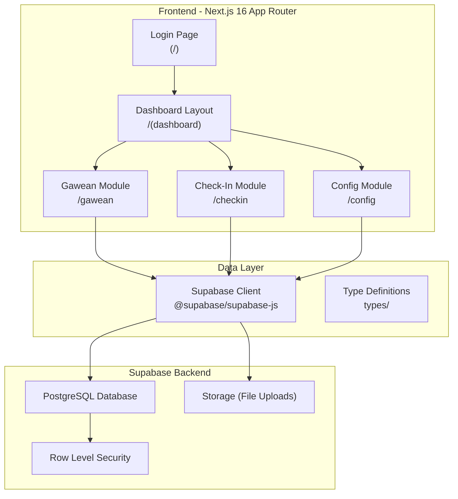
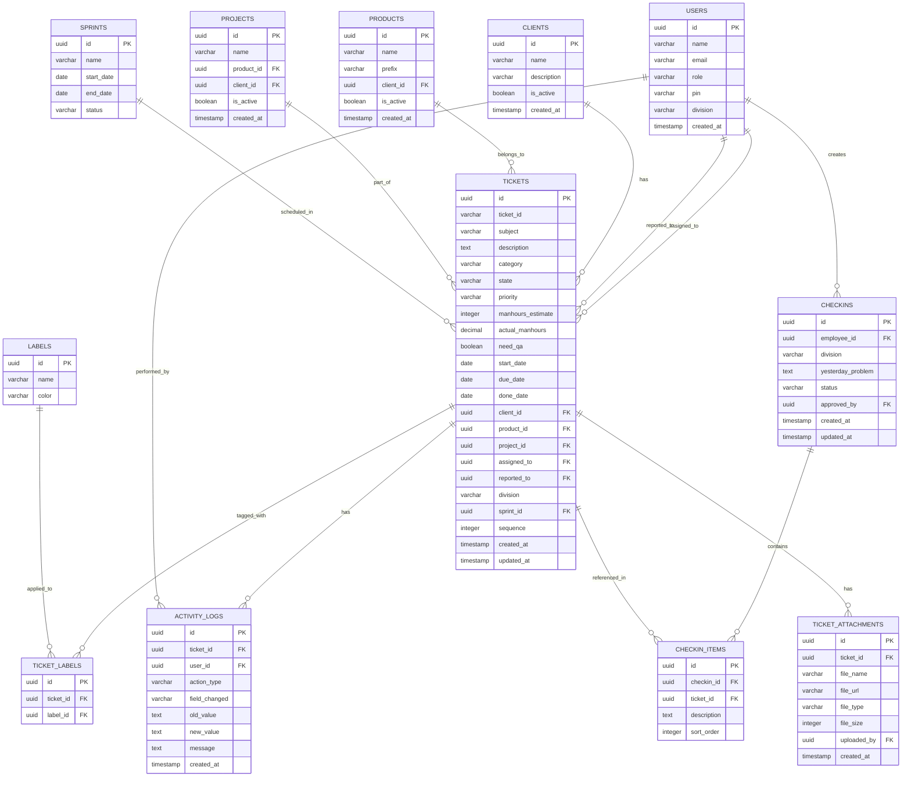
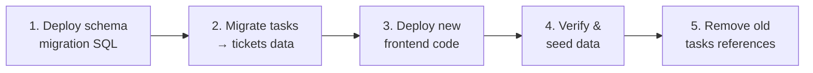

# TRD: Sistem Work Tracking ERP-Style — MST Ticket Manager

**Versi**: 1.0  
**Tanggal**: 29 Mei 2026  
**Penulis**: AI Assistant  
**Status**: Draft — Menunggu Review  
**Referensi PRD**: [prd_work_tracking.md](file:///C:/Users/LENOVO THINKPAD/.gemini/antigravity-ide/brain/026a5f8e-a9cb-470d-8710-2ae2075ab213/prd_work_tracking.md)

---

## 1. Arsitektur Sistem

### 1.1. Tech Stack Saat Ini

| Layer | Teknologi | Versi |
|-------|-----------|-------|
| Framework | Next.js (App Router) | ^16.2.6 |
| UI | React + TailwindCSS 4 | React 19.2.4 |
| Database | Supabase (PostgreSQL) | supabase-js ^2.106.2 |
| Icons | lucide-react | ^0.460.0 |
| Language | TypeScript | ^5 |
| Auth | Custom PIN-based (localStorage) | — |

### 1.2. Arsitektur High-Level



### 1.3. Routing Structure (App Router)

```
src/app/
├── page.tsx                          # Login page
├── layout.tsx                        # Root layout (fonts, metadata)
├── globals.css                       # Global styles
│
├── (dashboard)/
│   ├── layout.tsx                    # Dashboard shell (sidebar + topbar)
│   │
│   ├── gawean/                       # Modul Gawean (Ticket)
│   │   ├── page.tsx                  # Ticket list view
│   │   └── [id]/
│   │       └── page.tsx              # Ticket detail/edit view
│   │
│   ├── checkin/                      # Modul Check-In
│   │   ├── page.tsx                  # Check-in list view
│   │   └── new/
│   │       └── page.tsx              # New check-in form
│   │
│   ├── admin/                        # Admin dashboard (existing, enhanced)
│   │   └── page.tsx
│   │
│   ├── board/                        # Personal board (existing, enhanced)
│   │   └── page.tsx
│   │
│   └── config/                       # Konfigurasi
│       ├── clients/
│       │   └── page.tsx              # CRUD client
│       ├── products/
│       │   └── page.tsx              # CRUD product
│       ├── projects/
│       │   └── page.tsx              # CRUD project
│       └── users/
│           └── page.tsx              # CRUD user (enhanced)
```

---

## 2. Database Schema (Supabase / PostgreSQL)

### 2.1. Schema Overview — ERD



### 2.2. SQL Migration Scripts

#### 2.2.1. New Tables

```sql
-- =====================================================
-- MIGRATION: MST Ticket Manager → ERP Work Tracking
-- Version: 2.0.0
-- Date: 2026-05-29
-- =====================================================

-- ─────────────────────────────────────────────────────
-- 1. ENUM TYPES
-- ─────────────────────────────────────────────────────

-- Ticket States (10 states sesuai ERP reference)
CREATE TYPE ticket_state AS ENUM (
    'backlog',
    'todo', 
    'need_fix',
    'on_progress',
    'code_review',
    'ready_for_qa',
    'in_qa',
    'ready_to_deploy',
    'done',
    'cancel'
);

-- Ticket Priority
CREATE TYPE ticket_priority AS ENUM (
    'critical',    -- 1. Kritis
    'high',        -- 2. Tinggi
    'normal',      -- 3. Normal
    'low'          -- 4. Rendah
);

-- Ticket Category
CREATE TYPE ticket_category AS ENUM (
    'service_support',
    'finance_sales',
    'development',
    'infrastructure_operations',
    'qa_testing',
    'coordination_management',
    'design_ui_ux',
    'internal_learning'
);

-- Check-in Status
CREATE TYPE checkin_status AS ENUM (
    'draft',
    'approved'
);

-- ─────────────────────────────────────────────────────
-- 2. CLIENTS TABLE
-- ─────────────────────────────────────────────────────
CREATE TABLE clients (
    id UUID DEFAULT gen_random_uuid() PRIMARY KEY,
    name VARCHAR(255) NOT NULL,
    description TEXT,
    is_active BOOLEAN DEFAULT TRUE,
    created_at TIMESTAMPTZ DEFAULT NOW()
);

-- ─────────────────────────────────────────────────────
-- 3. PRODUCTS TABLE
-- ─────────────────────────────────────────────────────
CREATE TABLE products (
    id UUID DEFAULT gen_random_uuid() PRIMARY KEY,
    name VARCHAR(255) NOT NULL,
    prefix VARCHAR(10) NOT NULL UNIQUE,  -- e.g., 'ZB', 'DOB', 'INO'
    client_id UUID REFERENCES clients(id),
    is_active BOOLEAN DEFAULT TRUE,
    created_at TIMESTAMPTZ DEFAULT NOW()
);

-- ─────────────────────────────────────────────────────
-- 4. PROJECTS TABLE
-- ─────────────────────────────────────────────────────
CREATE TABLE projects (
    id UUID DEFAULT gen_random_uuid() PRIMARY KEY,
    name VARCHAR(255) NOT NULL,
    product_id UUID REFERENCES products(id),
    client_id UUID REFERENCES clients(id),
    is_active BOOLEAN DEFAULT TRUE,
    created_at TIMESTAMPTZ DEFAULT NOW()
);

-- ─────────────────────────────────────────────────────
-- 5. ALTER USERS TABLE (Add new columns)
-- ─────────────────────────────────────────────────────
ALTER TABLE users ADD COLUMN IF NOT EXISTS email VARCHAR(255);
ALTER TABLE users ADD COLUMN IF NOT EXISTS division VARCHAR(100);
ALTER TABLE users ADD COLUMN IF NOT EXISTS is_active BOOLEAN DEFAULT TRUE;
ALTER TABLE users ADD COLUMN IF NOT EXISTS created_at TIMESTAMPTZ DEFAULT NOW();

-- ─────────────────────────────────────────────────────
-- 6. LABELS TABLE
-- ─────────────────────────────────────────────────────
CREATE TABLE labels (
    id UUID DEFAULT gen_random_uuid() PRIMARY KEY,
    name VARCHAR(100) NOT NULL UNIQUE,
    color VARCHAR(7) DEFAULT '#6366f1'  -- Hex color
);

-- Seed default labels
INSERT INTO labels (name, color) VALUES
    ('System Request', '#3b82f6'),
    ('Carry Over', '#8b5cf6'),
    ('Bug Fix', '#ef4444'),
    ('Feature', '#22c55e'),
    ('Enhancement', '#f59e0b'),
    ('Documentation', '#6b7280');

-- ─────────────────────────────────────────────────────
-- 7. ENHANCED TICKETS TABLE
-- ─────────────────────────────────────────────────────
-- Drop old tasks table and recreate as tickets
-- (or ALTER if data migration is needed)

CREATE TABLE tickets (
    id UUID DEFAULT gen_random_uuid() PRIMARY KEY,
    
    -- Identification
    ticket_id VARCHAR(50) NOT NULL UNIQUE,
    sequence INTEGER NOT NULL DEFAULT 1,
    
    -- Content
    subject TEXT NOT NULL,
    description TEXT,
    
    -- Classification
    category ticket_category DEFAULT 'development',
    state ticket_state DEFAULT 'backlog',
    priority ticket_priority DEFAULT 'normal',
    
    -- Time tracking
    manhours_estimate INTEGER DEFAULT 0,
    actual_manhours DECIMAL(10,2) DEFAULT 0.00,
    need_qa BOOLEAN DEFAULT FALSE,
    
    -- Dates
    start_date DATE,
    due_date DATE,
    done_date DATE,
    
    -- Relations
    client_id UUID REFERENCES clients(id),
    product_id UUID REFERENCES products(id),
    project_id UUID REFERENCES projects(id),
    assigned_to UUID REFERENCES users(id),
    reported_to UUID REFERENCES users(id),
    division VARCHAR(100),
    sprint_id UUID REFERENCES sprints(id) ON DELETE SET NULL,
    
    -- Metadata
    created_by UUID REFERENCES users(id),
    created_at TIMESTAMPTZ DEFAULT NOW(),
    updated_at TIMESTAMPTZ DEFAULT NOW()
);

-- Auto-update updated_at
CREATE OR REPLACE FUNCTION update_updated_at()
RETURNS TRIGGER AS $$
BEGIN
    NEW.updated_at = NOW();
    RETURN NEW;
END;
$$ LANGUAGE plpgsql;

CREATE TRIGGER tickets_updated_at
    BEFORE UPDATE ON tickets
    FOR EACH ROW
    EXECUTE FUNCTION update_updated_at();

-- ─────────────────────────────────────────────────────
-- 8. TICKET-LABEL JUNCTION TABLE
-- ─────────────────────────────────────────────────────
CREATE TABLE ticket_labels (
    id UUID DEFAULT gen_random_uuid() PRIMARY KEY,
    ticket_id UUID NOT NULL REFERENCES tickets(id) ON DELETE CASCADE,
    label_id UUID NOT NULL REFERENCES labels(id) ON DELETE CASCADE,
    UNIQUE(ticket_id, label_id)
);

-- ─────────────────────────────────────────────────────
-- 9. TICKET ATTACHMENTS TABLE
-- ─────────────────────────────────────────────────────
CREATE TABLE ticket_attachments (
    id UUID DEFAULT gen_random_uuid() PRIMARY KEY,
    ticket_id UUID NOT NULL REFERENCES tickets(id) ON DELETE CASCADE,
    file_name VARCHAR(255) NOT NULL,
    file_url TEXT NOT NULL,
    file_type VARCHAR(100),
    file_size INTEGER,  -- bytes
    uploaded_by UUID REFERENCES users(id),
    created_at TIMESTAMPTZ DEFAULT NOW()
);

-- ─────────────────────────────────────────────────────
-- 10. ACTIVITY LOGS TABLE
-- ─────────────────────────────────────────────────────
CREATE TABLE activity_logs (
    id UUID DEFAULT gen_random_uuid() PRIMARY KEY,
    ticket_id UUID NOT NULL REFERENCES tickets(id) ON DELETE CASCADE,
    user_id UUID REFERENCES users(id),
    action_type VARCHAR(50) NOT NULL,  -- 'state_change', 'field_update', 'comment', 'checkin_ref', 'created'
    field_changed VARCHAR(100),
    old_value TEXT,
    new_value TEXT,
    message TEXT,
    created_at TIMESTAMPTZ DEFAULT NOW()
);

-- Index for fast activity log queries
CREATE INDEX idx_activity_logs_ticket ON activity_logs(ticket_id);
CREATE INDEX idx_activity_logs_created ON activity_logs(created_at DESC);

-- ─────────────────────────────────────────────────────
-- 11. CHECK-INS TABLE
-- ─────────────────────────────────────────────────────
CREATE TABLE checkins (
    id UUID DEFAULT gen_random_uuid() PRIMARY KEY,
    employee_id UUID NOT NULL REFERENCES users(id),
    division VARCHAR(100),
    yesterday_problem TEXT,
    status checkin_status DEFAULT 'draft',
    approved_by UUID REFERENCES users(id),
    created_at TIMESTAMPTZ DEFAULT NOW(),
    updated_at TIMESTAMPTZ DEFAULT NOW()
);

CREATE TRIGGER checkins_updated_at
    BEFORE UPDATE ON checkins
    FOR EACH ROW
    EXECUTE FUNCTION update_updated_at();

-- ─────────────────────────────────────────────────────
-- 12. CHECK-IN ITEMS TABLE
-- ─────────────────────────────────────────────────────
CREATE TABLE checkin_items (
    id UUID DEFAULT gen_random_uuid() PRIMARY KEY,
    checkin_id UUID NOT NULL REFERENCES checkins(id) ON DELETE CASCADE,
    ticket_id UUID REFERENCES tickets(id) ON DELETE SET NULL,
    description TEXT,
    sort_order INTEGER DEFAULT 0
);

-- ─────────────────────────────────────────────────────
-- 13. TICKET ID AUTO-GENERATION FUNCTION
-- ─────────────────────────────────────────────────────
CREATE OR REPLACE FUNCTION generate_ticket_id(product_prefix VARCHAR)
RETURNS VARCHAR AS $$
DECLARE
    next_seq INTEGER;
    new_ticket_id VARCHAR;
BEGIN
    -- Get next sequence for this prefix
    SELECT COALESCE(MAX(sequence), 0) + 1 INTO next_seq
    FROM tickets
    WHERE ticket_id LIKE product_prefix || '-%';
    
    new_ticket_id := product_prefix || '-' || next_seq;
    RETURN new_ticket_id;
END;
$$ LANGUAGE plpgsql;

-- ─────────────────────────────────────────────────────
-- 14. ROW LEVEL SECURITY
-- ─────────────────────────────────────────────────────
ALTER TABLE clients ENABLE ROW LEVEL SECURITY;
ALTER TABLE products ENABLE ROW LEVEL SECURITY;
ALTER TABLE projects ENABLE ROW LEVEL SECURITY;
ALTER TABLE labels ENABLE ROW LEVEL SECURITY;
ALTER TABLE tickets ENABLE ROW LEVEL SECURITY;
ALTER TABLE ticket_labels ENABLE ROW LEVEL SECURITY;
ALTER TABLE ticket_attachments ENABLE ROW LEVEL SECURITY;
ALTER TABLE activity_logs ENABLE ROW LEVEL SECURITY;
ALTER TABLE checkins ENABLE ROW LEVEL SECURITY;
ALTER TABLE checkin_items ENABLE ROW LEVEL SECURITY;

-- For MVP: Allow all (will be restricted later)
CREATE POLICY "Allow all on clients" ON clients FOR ALL USING (true) WITH CHECK (true);
CREATE POLICY "Allow all on products" ON products FOR ALL USING (true) WITH CHECK (true);
CREATE POLICY "Allow all on projects" ON projects FOR ALL USING (true) WITH CHECK (true);
CREATE POLICY "Allow all on labels" ON labels FOR ALL USING (true) WITH CHECK (true);
CREATE POLICY "Allow all on tickets" ON tickets FOR ALL USING (true) WITH CHECK (true);
CREATE POLICY "Allow all on ticket_labels" ON ticket_labels FOR ALL USING (true) WITH CHECK (true);
CREATE POLICY "Allow all on ticket_attachments" ON ticket_attachments FOR ALL USING (true) WITH CHECK (true);
CREATE POLICY "Allow all on activity_logs" ON activity_logs FOR ALL USING (true) WITH CHECK (true);
CREATE POLICY "Allow all on checkins" ON checkins FOR ALL USING (true) WITH CHECK (true);
CREATE POLICY "Allow all on checkin_items" ON checkin_items FOR ALL USING (true) WITH CHECK (true);

-- ─────────────────────────────────────────────────────
-- 15. INDEXES FOR PERFORMANCE
-- ─────────────────────────────────────────────────────
CREATE INDEX idx_tickets_state ON tickets(state);
CREATE INDEX idx_tickets_assigned ON tickets(assigned_to);
CREATE INDEX idx_tickets_client ON tickets(client_id);
CREATE INDEX idx_tickets_product ON tickets(product_id);
CREATE INDEX idx_tickets_sprint ON tickets(sprint_id);
CREATE INDEX idx_tickets_due_date ON tickets(due_date);
CREATE INDEX idx_tickets_created ON tickets(created_at DESC);
CREATE INDEX idx_checkins_employee ON checkins(employee_id);
CREATE INDEX idx_checkins_created ON checkins(created_at DESC);
CREATE INDEX idx_checkin_items_ticket ON checkin_items(ticket_id);
```

### 2.3. Data Migration (Tasks → Tickets)

```sql
-- Migrate existing tasks data to new tickets table
-- Run this AFTER creating new tables

INSERT INTO tickets (
    ticket_id, subject, description, category, state, priority,
    division, start_date, due_date, created_at
)
SELECT
    task_id,
    title,
    NULL,  -- no description in old schema
    'development'::ticket_category,
    CASE status
        WHEN 'Belum Mulai' THEN 'backlog'::ticket_state
        WHEN 'Sedang Dikerjakan' THEN 'on_progress'::ticket_state
        WHEN 'Selesai' THEN 'done'::ticket_state
        ELSE 'backlog'::ticket_state
    END,
    CASE priority
        WHEN 'Rendah' THEN 'low'::ticket_priority
        WHEN 'Normal' THEN 'normal'::ticket_priority
        WHEN 'Tinggi' THEN 'high'::ticket_priority
        WHEN 'Kritis' THEN 'critical'::ticket_priority
        ELSE 'normal'::ticket_priority
    END,
    division,
    start_date,
    end_date,
    created_at
FROM tasks;
```

---

## 3. TypeScript Type Definitions

### 3.1. Core Types

```typescript
// src/types/index.ts

// ─── Enums ───────────────────────────────────────────

export type TicketState = 
    | 'backlog'
    | 'todo'
    | 'need_fix'
    | 'on_progress'
    | 'code_review'
    | 'ready_for_qa'
    | 'in_qa'
    | 'ready_to_deploy'
    | 'done'
    | 'cancel';

export type TicketPriority = 'critical' | 'high' | 'normal' | 'low';

export type TicketCategory = 
    | 'service_support'
    | 'finance_sales'
    | 'development'
    | 'infrastructure_operations'
    | 'qa_testing'
    | 'coordination_management'
    | 'design_ui_ux'
    | 'internal_learning';

export type CheckinStatus = 'draft' | 'approved';

// ─── Database Models ─────────────────────────────────

export interface User {
    id: string;
    name: string;
    email?: string;
    role: string;
    pin: string;
    division?: string;
    is_active: boolean;
    created_at: string;
}

export interface Client {
    id: string;
    name: string;
    description?: string;
    is_active: boolean;
    created_at: string;
}

export interface Product {
    id: string;
    name: string;
    prefix: string;    // e.g., 'ZB', 'DOB'
    client_id?: string;
    is_active: boolean;
    created_at: string;
    // Relations
    client?: Client;
}

export interface Project {
    id: string;
    name: string;
    product_id?: string;
    client_id?: string;
    is_active: boolean;
    created_at: string;
    // Relations
    product?: Product;
    client?: Client;
}

export interface Label {
    id: string;
    name: string;
    color: string;
}

export interface Ticket {
    id: string;
    ticket_id: string;
    sequence: number;
    subject: string;
    description?: string;
    category: TicketCategory;
    state: TicketState;
    priority: TicketPriority;
    manhours_estimate: number;
    actual_manhours: number;
    need_qa: boolean;
    start_date?: string;
    due_date?: string;
    done_date?: string;
    client_id?: string;
    product_id?: string;
    project_id?: string;
    assigned_to?: string;
    reported_to?: string;
    division?: string;
    sprint_id?: string;
    created_by?: string;
    created_at: string;
    updated_at: string;
    // Relations (populated via joins)
    client?: Client;
    product?: Product;
    project?: Project;
    assignee?: User;
    reporter?: User;
    sprint?: Sprint;
    labels?: Label[];
    attachments?: TicketAttachment[];
    activity_logs?: ActivityLog[];
}

export interface TicketAttachment {
    id: string;
    ticket_id: string;
    file_name: string;
    file_url: string;
    file_type?: string;
    file_size?: number;
    uploaded_by?: string;
    created_at: string;
}

export interface ActivityLog {
    id: string;
    ticket_id: string;
    user_id?: string;
    action_type: 'state_change' | 'field_update' | 'comment' | 'checkin_ref' | 'created';
    field_changed?: string;
    old_value?: string;
    new_value?: string;
    message?: string;
    created_at: string;
    // Relations
    user?: User;
}

export interface Sprint {
    id: string;
    name: string;
    start_date: string;
    end_date: string;
    status: string;
}

export interface Checkin {
    id: string;
    employee_id: string;
    division?: string;
    yesterday_problem?: string;
    status: CheckinStatus;
    approved_by?: string;
    created_at: string;
    updated_at: string;
    // Relations
    employee?: User;
    approver?: User;
    items?: CheckinItem[];
}

export interface CheckinItem {
    id: string;
    checkin_id: string;
    ticket_id?: string;
    description?: string;
    sort_order: number;
    // Relations
    ticket?: Ticket;
}

// ─── UI Helper Types ─────────────────────────────────

export interface StateConfig {
    value: TicketState;
    label: string;
    color: string;        // Tailwind bg class
    textColor: string;    // Tailwind text class
    icon?: string;
}

export interface PriorityConfig {
    value: TicketPriority;
    label: string;
    level: number;
    color: string;
    textColor: string;
}

export interface CategoryConfig {
    value: TicketCategory;
    label: string;
}

// ─── Filter & Pagination ────────────────────────────

export interface TicketFilters {
    search?: string;
    state?: TicketState[];
    priority?: TicketPriority[];
    category?: TicketCategory[];
    assigned_to?: string;
    client_id?: string;
    product_id?: string;
    sprint_id?: string;
    assign_to_me?: boolean;
}

export interface PaginationParams {
    page: number;
    pageSize: number;
    sortBy: string;
    sortOrder: 'asc' | 'desc';
}

export interface PaginatedResponse<T> {
    data: T[];
    total: number;
    page: number;
    pageSize: number;
    totalPages: number;
}
```

---

## 4. Komponen React & UI Architecture

### 4.1. Component Tree

```
src/
├── components/
│   ├── ui/                           # Reusable UI components
│   │   ├── Badge.tsx                 # Status/priority/label badges
│   │   ├── Modal.tsx                 # Reusable modal wrapper
│   │   ├── Pagination.tsx            # Pagination controls
│   │   ├── DataTable.tsx             # Reusable table with sorting
│   │   ├── FilterBar.tsx             # Filter toolbar
│   │   ├── TagInput.tsx              # Multi-tag input for labels
│   │   ├── FileUpload.tsx            # File upload with preview
│   │   ├── SearchInput.tsx           # Search with debounce
│   │   ├── StatCard.tsx              # Dashboard stat card
│   │   └── EmptyState.tsx            # Empty state placeholder
│   │
│   ├── gawean/                       # Ticket-specific components
│   │   ├── TicketList.tsx            # Full ticket list with table
│   │   ├── TicketDetail.tsx          # Ticket detail form
│   │   ├── TicketForm.tsx            # Create/edit ticket form
│   │   ├── StateDropdown.tsx         # State selector with workflow
│   │   ├── StateBreadcrumb.tsx       # [PROGRESS] [CODE REVIEW] bar
│   │   ├── ActivityTimeline.tsx      # Activity log sidebar
│   │   └── TicketIdBadge.tsx         # Styled ticket ID
│   │
│   ├── checkin/                      # Check-in specific components
│   │   ├── CheckinList.tsx           # Check-in list view
│   │   ├── CheckinForm.tsx           # New check-in form
│   │   ├── ActionItemEditor.tsx      # Action items with ticket refs
│   │   └── CheckinStatusBadge.tsx    # Draft/Approved badge
│   │
│   └── layout/                       # Layout components
│       ├── Sidebar.tsx               # Enhanced sidebar navigation
│       ├── TopBar.tsx                # Top navigation bar
│       └── Breadcrumb.tsx            # Page breadcrumb
│
├── hooks/                            # Custom React hooks
│   ├── useTickets.ts                 # Ticket CRUD & filtering
│   ├── useCheckins.ts                # Check-in CRUD
│   ├── useActivityLog.ts            # Activity log operations
│   ├── useUsers.ts                   # User operations
│   └── usePagination.ts             # Pagination state
│
├── lib/                              # Utility libraries
│   ├── constants.ts                  # State configs, priority configs
│   ├── ticket-utils.ts              # Ticket ID generation, state transitions
│   └── date-utils.ts                # Date formatting (Indonesian locale)
│
├── types/                            # TypeScript definitions
│   └── index.ts                      # All types (from section 3)
│
└── utils/
    └── supabase.ts                   # Supabase client (existing)
```

### 4.2. State Configuration Constants

```typescript
// src/lib/constants.ts

import { StateConfig, PriorityConfig, CategoryConfig } from '@/types';

export const TICKET_STATES: StateConfig[] = [
    { value: 'backlog',          label: 'Backlog',          color: 'bg-slate-100',   textColor: 'text-slate-700' },
    { value: 'todo',             label: 'ToDo',             color: 'bg-blue-100',    textColor: 'text-blue-800' },
    { value: 'need_fix',         label: 'Need Fix',         color: 'bg-amber-100',   textColor: 'text-amber-800' },
    { value: 'on_progress',      label: 'On Progress',      color: 'bg-emerald-100', textColor: 'text-emerald-800' },
    { value: 'code_review',      label: 'Code Review',      color: 'bg-purple-100',  textColor: 'text-purple-800' },
    { value: 'ready_for_qa',     label: 'Ready For QA',     color: 'bg-cyan-100',    textColor: 'text-cyan-800' },
    { value: 'in_qa',            label: 'In QA',            color: 'bg-teal-100',    textColor: 'text-teal-800' },
    { value: 'ready_to_deploy',  label: 'Ready to Deploy',  color: 'bg-indigo-100',  textColor: 'text-indigo-800' },
    { value: 'done',             label: 'Done',             color: 'bg-green-100',   textColor: 'text-green-800' },
    { value: 'cancel',           label: 'Cancel',           color: 'bg-red-100',     textColor: 'text-red-800' },
];

export const TICKET_PRIORITIES: PriorityConfig[] = [
    { value: 'critical', label: '1. Kritis (Urgent)',  level: 1, color: 'bg-red-100',    textColor: 'text-red-700' },
    { value: 'high',     label: '2. Tinggi (High)',    level: 2, color: 'bg-orange-100', textColor: 'text-orange-700' },
    { value: 'normal',   label: '3. Normal (Sedang)',  level: 3, color: 'bg-indigo-100', textColor: 'text-indigo-700' },
    { value: 'low',      label: '4. Rendah (Low)',     level: 4, color: 'bg-slate-100',  textColor: 'text-slate-600' },
];

export const TICKET_CATEGORIES: CategoryConfig[] = [
    { value: 'service_support',            label: 'Service & Support' },
    { value: 'finance_sales',              label: 'Finance & Sales' },
    { value: 'development',                label: 'Development' },
    { value: 'infrastructure_operations',  label: 'Infrastructure & Operations' },
    { value: 'qa_testing',                 label: 'QA & Testing' },
    { value: 'coordination_management',    label: 'Coordination & Management' },
    { value: 'design_ui_ux',              label: 'Design (UI/UX)' },
    { value: 'internal_learning',          label: 'Internal & Learning' },
];

// Valid state transitions
export const STATE_TRANSITIONS: Record<string, string[]> = {
    backlog:          ['todo', 'cancel'],
    todo:             ['on_progress', 'need_fix', 'cancel'],
    need_fix:         ['on_progress', 'cancel'],
    on_progress:      ['code_review', 'cancel'],
    code_review:      ['on_progress', 'ready_for_qa'],
    ready_for_qa:     ['in_qa'],
    in_qa:            ['on_progress', 'ready_to_deploy'],
    ready_to_deploy:  ['done'],
    done:             [],  // Terminal state
    cancel:           [],  // Terminal state
};
```

### 4.3. Key Custom Hooks

```typescript
// src/hooks/useTickets.ts (pseudo-code)

export function useTickets(filters: TicketFilters, pagination: PaginationParams) {
    // State
    const [tickets, setTickets] = useState<Ticket[]>([]);
    const [total, setTotal] = useState(0);
    const [loading, setLoading] = useState(true);

    // Fetch with filters + pagination + sorting
    async function fetchTickets() {
        let query = supabase
            .from('tickets')
            .select('*, client:clients(*), assignee:users!assigned_to(*), ...', { count: 'exact' });
        
        // Apply filters
        if (filters.search) query = query.ilike('subject', `%${filters.search}%`);
        if (filters.state?.length) query = query.in('state', filters.state);
        if (filters.assigned_to) query = query.eq('assigned_to', filters.assigned_to);
        if (filters.assign_to_me) query = query.eq('assigned_to', currentUserId);
        
        // Pagination
        const from = (pagination.page - 1) * pagination.pageSize;
        const to = from + pagination.pageSize - 1;
        query = query.range(from, to);
        
        // Sorting
        query = query.order(pagination.sortBy, { ascending: pagination.sortOrder === 'asc' });
        
        const { data, count, error } = await query;
        // ...
    }

    // State transition with activity log
    async function updateTicketState(ticketId: string, newState: TicketState) {
        const ticket = tickets.find(t => t.id === ticketId);
        if (!ticket) return;

        // Validate transition
        const validTransitions = STATE_TRANSITIONS[ticket.state];
        if (!validTransitions.includes(newState)) {
            throw new Error(`Invalid transition: ${ticket.state} → ${newState}`);
        }

        // Update ticket
        await supabase.from('tickets').update({
            state: newState,
            done_date: newState === 'done' ? new Date().toISOString() : null
        }).eq('id', ticketId);

        // Log activity
        await supabase.from('activity_logs').insert({
            ticket_id: ticketId,
            user_id: currentUserId,
            action_type: 'state_change',
            field_changed: 'state',
            old_value: ticket.state,
            new_value: newState,
        });
    }

    return { tickets, total, loading, fetchTickets, updateTicketState, ... };
}
```

---

## 5. API Layer Design

### 5.1. Supabase Queries Map

| Operation | Table(s) | Method | Notes |
|-----------|----------|--------|-------|
| List tickets | `tickets` + joins | `SELECT` with filters, pagination, sorting | Join: clients, users, products |
| Get ticket detail | `tickets` + all relations | `SELECT` with nested joins | Include: labels, attachments, activity_logs |
| Create ticket | `tickets` + `activity_logs` | `INSERT` (transaction) | Auto-generate ticket_id |
| Update ticket | `tickets` + `activity_logs` | `UPDATE` + `INSERT` log | Log setiap field change |
| Update ticket state | `tickets` + `activity_logs` | `UPDATE` + `INSERT` log | Validate state transition |
| List check-ins | `checkins` + `checkin_items` | `SELECT` with joins | Join: users, tickets |
| Create check-in | `checkins` + `checkin_items` | `INSERT` (transaction) | Create items + log to tickets |
| Approve check-in | `checkins` | `UPDATE` | Admin only |
| Upload attachment | `ticket_attachments` + Storage | `INSERT` + Storage upload | Use Supabase Storage |
| Manage labels | `labels` + `ticket_labels` | CRUD | Admin only |
| CRUD clients | `clients` | CRUD | Admin only |
| CRUD products | `products` | CRUD | Admin only |
| CRUD projects | `projects` | CRUD | Admin only |

### 5.2. Supabase Storage Buckets

```
Storage Buckets:
├── ticket-attachments/     # File attachments per ticket
│   └── {ticket_id}/
│       └── {filename}
```

---

## 6. UI/UX Design Specifications

### 6.1. Navigation Redesign

**Dari (saat ini):**
```
Sidebar:
  MST Workspace
  ├── Admin Dashboard
  └── Tugas Saya
```

**Menjadi:**
```
Top Navigation Bar:
  [Logo] MST    Gawean   Check In   Config         [🔔] [User Avatar ▾]

Sub-navigation per module:
  Gawean → Ticket List, My Tickets
  Check In → Today's Check-ins, New Check-in
  Config → Clients, Products, Projects, Users, Labels
```

### 6.2. Color Palette for States

| State | Background | Text | Hex |
|-------|-----------|------|-----|
| Backlog | `#f1f5f9` | `#334155` | Slate |
| ToDo | `#dbeafe` | `#1e40af` | Blue |
| Need Fix | `#fef3c7` | `#92400e` | Amber |
| On Progress | `#d1fae5` | `#065f46` | Emerald |
| Code Review | `#ede9fe` | `#5b21b6` | Purple |
| Ready For QA | `#cffafe` | `#155e75` | Cyan |
| In QA | `#ccfbf1` | `#134e4a` | Teal |
| Ready to Deploy | `#e0e7ff` | `#3730a3` | Indigo |
| Done | `#dcfce7` | `#166534` | Green |
| Cancel | `#fee2e2` | `#991b1b` | Red |

### 6.3. Responsive Breakpoints

| Breakpoint | Layout |
|------------|--------|
| Mobile (< 768px) | Stack layout, hamburger menu, card-based lists |
| Tablet (768-1024px) | Condensed table, collapsible sidebar |
| Desktop (> 1024px) | Full table, side-by-side detail + activity log |

---

## 7. Performa & Scalability

### 7.1. Database Indexes

Sudah didefinisikan di schema (Section 2.2):
- `idx_tickets_state` — Filter by state
- `idx_tickets_assigned` — "Assign to Me" filter
- `idx_tickets_due_date` — Sort by due date
- `idx_tickets_created` — Default sort
- `idx_activity_logs_ticket` — Load activity per ticket
- `idx_checkins_employee` — Load check-ins per user

### 7.2. Query Optimization

- **List View**: Pagination (20 per page), hanya fetch kolom yang ditampilkan
- **Detail View**: Lazy load activity logs & attachments
- **Check-in List**: Filter by date (hari ini) secara default
- **Search**: Debounced input (300ms) untuk mengurangi query

### 7.3. File Storage

- Max file size: **10MB** per attachment
- Allowed types: PDF, Images (PNG/JPG/WebP), Documents (DOC/DOCX/XLS/XLSX)
- Storage bucket: `ticket-attachments` (Supabase Storage)

---

## 8. Migration Plan dari Sistem Lama

### 8.1. Backward Compatibility

| Fitur Lama | Aksi | Detail |
|-----------|------|--------|
| `tasks` table | **MIGRATE** → `tickets` | Script migrasi di Section 2.3 |
| `users` table | **ALTER** (add columns) | Tambah email, division, is_active |
| `sprints` table | **KEEP** (as-is) | Relasi ke tickets via sprint_id |
| Login PIN-based | **KEEP** (untuk V1) | Bisa upgrade ke email+password nanti |
| Admin page (`/admin`) | **ENHANCE** | Tambah stats & link ke gawean |
| Board page (`/board`) | **ENHANCE** | Upgrade status dropdown ke 10 states |

### 8.2. Step-by-Step Migration



1. **Schema Migration**: Run SQL scripts di Supabase dashboard
2. **Data Migration**: Run migration query (tasks → tickets)
3. **Frontend Deploy**: Deploy kode baru dengan routing baru
4. **Verify**: Test semua fitur, seed client/product/project data
5. **Cleanup**: Hapus referensi lama ke tabel `tasks`

---

## 9. Testing & Verification Plan

### 9.1. Unit Tests

| Komponen | Test Case |
|----------|-----------|
| State Transitions | Validasi semua transition yang valid & invalid |
| Ticket ID Generation | Format correct, unique, sequential per prefix |
| Filter Logic | Combine multiple filters correctly |
| Date Formatting | Indonesian locale, relative time |

### 9.2. Integration Tests

| Flow | Steps |
|------|-------|
| Create Ticket | Form → DB insert → Activity log created → List updated |
| State Change | Dropdown → Validate transition → DB update → Log → Badge update |
| Daily Check-in | Form → Items + ticket refs → DB insert → Check-in list |
| Ticket Detail | Load ticket → Load relations → Load activity log → Render |

### 9.3. Manual Verification

1. **Visual**: Bandingkan UI dengan screenshot ERP referensi
2. **Flow**: Test complete workflow dari Backlog → Done
3. **Responsive**: Test di mobile, tablet, desktop
4. **Demo mode**: Pastikan fallback mock data masih berfungsi

---

## 10. Estimasi Effort

| Phase | Komponen | Estimasi |
|-------|----------|----------|
| Phase 1 | Database schema + migration | 2 jam |
| Phase 1 | Types + constants + utilities | 1 jam |
| Phase 1 | Enhanced ticket list + filters | 4 jam |
| Phase 1 | Ticket detail + activity log | 4 jam |
| Phase 1 | Ticket form (create/edit) | 3 jam |
| Phase 1 | Navigation redesign | 2 jam |
| Phase 2 | Check-in list view | 3 jam |
| Phase 2 | Check-in form | 3 jam |
| Phase 3 | File attachment | 2 jam |
| Phase 3 | Label management | 2 jam |
| Phase 3 | Config pages (CRUD) | 3 jam |
| | **Total Estimasi** | **~29 jam** |

---

## 11. Open Technical Questions

> [!IMPORTANT]
> **TQ1**: Apakah Supabase Storage sudah di-setup untuk bucket `ticket-attachments`? Jika belum, perlu dibuat di Supabase dashboard sebelum fitur attachment bisa digunakan.

> [!IMPORTANT]
> **TQ2**: Apakah perlu menggunakan **Supabase Realtime** untuk auto-refresh saat ada perubahan state tiket oleh user lain? Ini akan meningkatkan kompleksitas tetapi memberikan UX yang lebih baik.

> [!WARNING]
> **TQ3**: Database schema menggunakan **PostgreSQL ENUM types**. Jika di masa depan perlu menambah state/category baru, perlu `ALTER TYPE ... ADD VALUE`. Alternatif: gunakan VARCHAR dengan constraint CHECK — lebih fleksibel tapi kurang strict.

> [!NOTE]
> **TQ4**: Apakah field `Repeat` (recurring task) pada ERP referensi perlu diimplementasikan di fase ini, atau bisa di-skip?

> [!NOTE]
> **TQ5**: Tabel lama `tasks` — apakah langsung di-DROP setelah migrasi, atau di-keep sebagai backup selama masa transisi?
